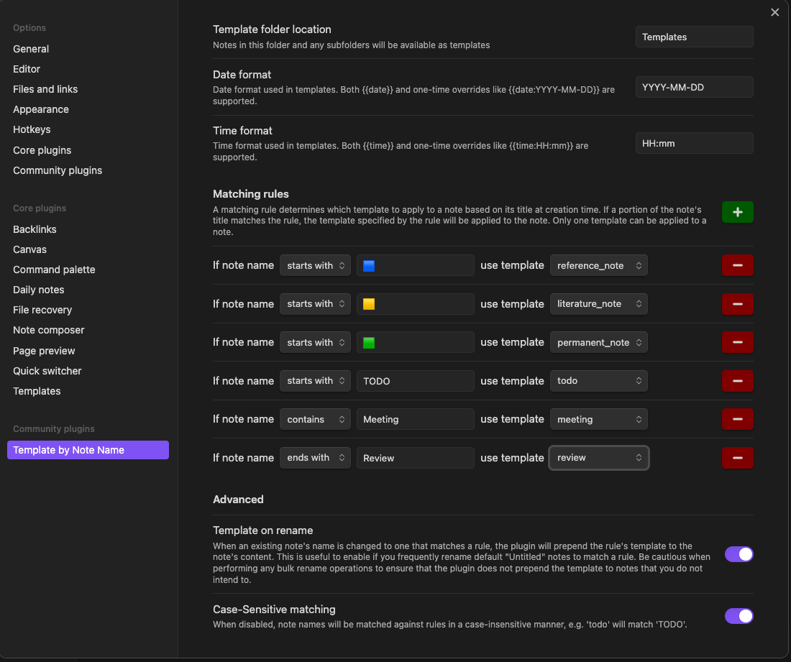

# Obsidian Template by Note Name

This is a simple [Obsidian](https://obsidian.md/) plugin to automatically template notes
based on their name when created or renamed. Users can template notes that match
their desired naming conventions with any template that exists in their
specified templates folder (including sub-folders).

For example, a user whose template
folder `Templates` contains a `TODO.md` note, can create a rule in the plugin settings
to automatically template any note that starts with `TODO` with the content of the `TODO.md` note.

## Features

- **Quicker templating**: Automatically template notes based on their name at creation time
- **Customizable**: Users can create rules to template notes based on their personal naming conventions
- **Multiple match options**: Choose from prefix, suffix, or contains to template notes
- **Optionally template on rename**: Choose whether or not to template notes when they are renamed
  If a note is renamed to a matching template, the template content will be prepended to the existing note.

## Settings

